### Overview

This automated Etch-a-Sketch can draw simple black and white images like the the Mona Lisa:

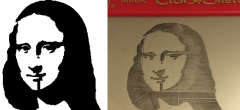

### Parts List

1. 1x [Etch-a-Sketch](http://www.amazon.com/Classic-Etch-Sketch-Magic-Screen/dp/B00000J0HG/)
2. 1x [Arduino UNO](http://www.adafruit.com/products/50)
3. 2x [Stepper Motors](https://www.adafruit.com/products/918)
4. 1x 12V Power Supply for stepper motors. An old PC power supply works perfectly for this.
5. 1x [ULN2803](http://www.digikey.com/product-detail/en/ULN2803A/497-2356-5-ND/599591)
6. 1x [Breadboard](http://www.adafruit.com/products/64)
7. 1x Foot of rubber tubing. It should have a 3/16in inner diameter and outer diameter of about 5/16in.
8. 2x [Motor Mounts](http://www.shapeways.com/model/848459/motor-mount-r2.html) (Sandstone material is recommended)
9. Small zip ties (variety pack will cost less than $10 at a local hardware store)
10. Gorilla Glue (local hardware store)
12. These [breadboard wires](http://www.adafruit.com/products/153) also work well for hooking it all up.

### Mounting Motors

1. Start by removing the white nobs from the Etch-a-Sketch. A flathead screwdriver can pry them off: 
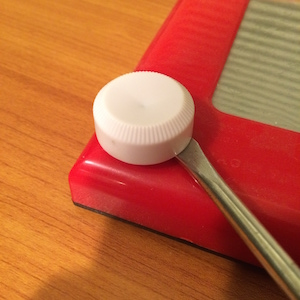

2. Place the motor mounts on the Etch-a-Sketch: 
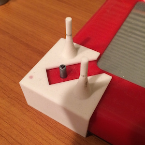

3. Now place the motors on the mounts with the wires directed towards the screen. The mount's poles may need to be sanded down to fit the motor: 
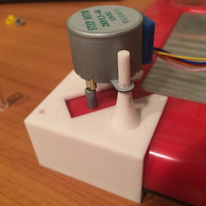

4. Next cutut off two pieces of rubber tubing. Each piece should be 17 mm long: 
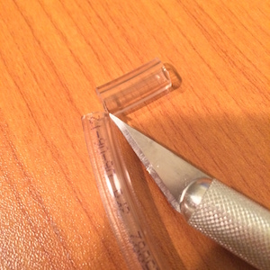

5. Put Gorilla Glue on the motor shaft and slide the tubing over the shaft. Use a small zip tie to ensure a tight fit between the tubing and motor. Let the glue dry for about 5 minutes. Once the glue has set twist the motor shaft back and forth a few times to break any glue that might prevent the motor from turning: 
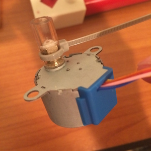

6. Place the motor back on the mount. The tubing should slide over the nob and connect the motor shaft with the nob. Use another zip tie to ensure a tight fit with the tubing and the nob: 
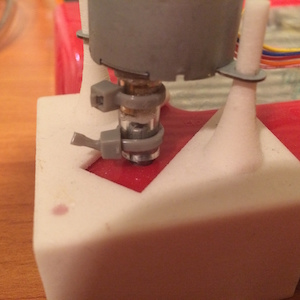

### Wiring

We use the ULN2803 to switch to the 12V required by the motors. The mapping between the Arudino output pins, the ULN2803 and the motors is described in the table and schematics below:

	  Arduino        ULN2803          Motor
	-----------    -----------    -------------
	     4          In/Out 8       Right Orange
	     5          In/Out 7       Right Yellow
	     6          In/Out 6       Right Pink
	     7          In/Out 5       Right Blue
	     8          In/Out 4       Left Orange
	     9          In/Out 3       Left Yellow
	     10         In/Out 2       Left Pink
	     11         In/Out 1       Left Blue

<a href="Schematics/layout_schematic.png" target="_blank">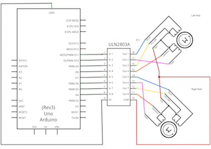</a>

<a href="Schematics/layout_bread_board.png" target="_blank">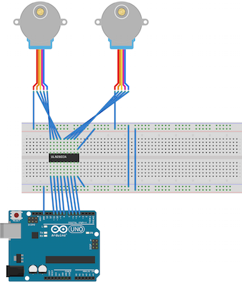</a>

It's also important to connect the ULN2803's COM to the 12V source on the power supply. That's easily done by connecting the power supply to the breadboard's positive and negative lines.

Once everything is wired up it should look something like this:

<a href="Schematics/Images/wiredup.jpg" target="_blank">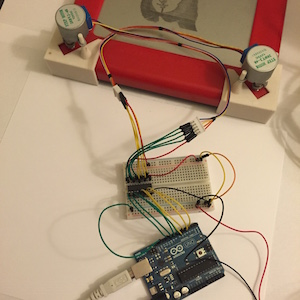</a>

### Software

1. First checkout all the source code from bitbucket.
2. Next use the [Arduino Software](http://arduino.cc/en/Main/Software) to build and install the [SketchTheEtch.cpp](http://blah/arduino/SketchTheEtch/SketchTheEtch.cpp) on the Arduino.
3. Install the following python dependencies Pillow (a PIL replacement) and pyserial. Both can be installed with pip:

		pip install pyserial
		pip install Pillow

4. From the checked out repo run `python ControlScripts/control.py /dev/tty.PathToUsbDevice`. The `/dev/tty.PathToUsbDevice` will be the same path selected in the Arduino software. This script is used for positioning and testing the device. Here is a basic set of commands that can be issued at the prompt:

		d,c> d 40 #drives the head down 40 pixels
		d,c> r 20 #drives the head right 40 pixels
		d, u, l, r can all be used followed by an integer indicating the number of points to drive
		
		d,c> s #powers down the coils in the motors
		
		d,c> vtest #draws a series of shrinking circles
		
The Arduino Firmware works by receiving a vector to draw. It draws the vector and then sends a message back to the host indicating it is ready for the next command. The `ImagePoints.py` script takes a black and white image as input and traces through the solid black pixels. All the black pixels must form a single contiguous region.

As an example we can trace the Mona Lisa:

	python ControlScripts/ImagePoints.py SamplesAssets/mona.png

The initial position of the head must be done manaully. For `mona.png` the top center of the Etch-a-Sketch will work just fine.

### Custom Images

The maximum resolution is about 550x370. However, I recommend images no larger than 500x320 to account for any error.

Tracing starts from the top of the image and works its way from left-to-right. The best initial position corresponds to the left most pixel in the first row of black pixels and its position relative to the rest of the image. The following samples illustrate the best initial position with a yellow square: 
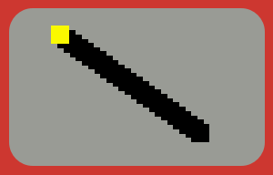 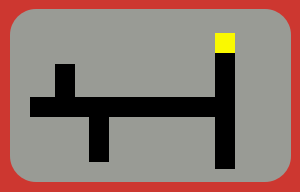 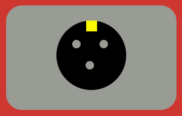

### Known Issues

- Driving in one direction too long causes some error in the sense the line isn't as long as it should be. This can be by driving in one direction a shorter distance < 50 points ideally
- Motor mounts move a bit too much when motors change direction. This certainly contributes to some error but hasn't been a huge issue for me. This requires a hardware change such as:
	+ Fixing the motors else where and using a belt to drive the knobs
	+ Fixing the motors mounts to each other so there isn't as much movement
- Image analysis to suggest where to initally position the head or always assume the head is positioned in the upper left
- 

### Contact

Feel free to contact me with any questions <annglove+etch@gmail.com>

### Notes to self

- Args to the script (both control.py and ImagePoints.py)
- position in the upper left then draw a single line to the position that will correctly fit the image on the screen
- consider rotating lines into squares to that we don't run the motors a long time in one direction. Given a stack of lines prefer the shorter lines distance
- slice sections of the timage into 50x50 sections to draw. Complete the section before moving on...
- Brushes in Acorn/Photoshop to create a shading effect

For image processing and canny edge detection
	
	numpy
	scikit-image
	scipy
	matplotlib

