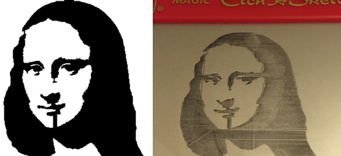

## Overview

This project demonstrates how to build a simple automated Etch-a-Sketch. It produces images that look something like this:

Instructions on how to build and use the device can be found [here](EtchingStepByStep.md) and at my [website](http://www.evanlong.info/projects/etching/).
